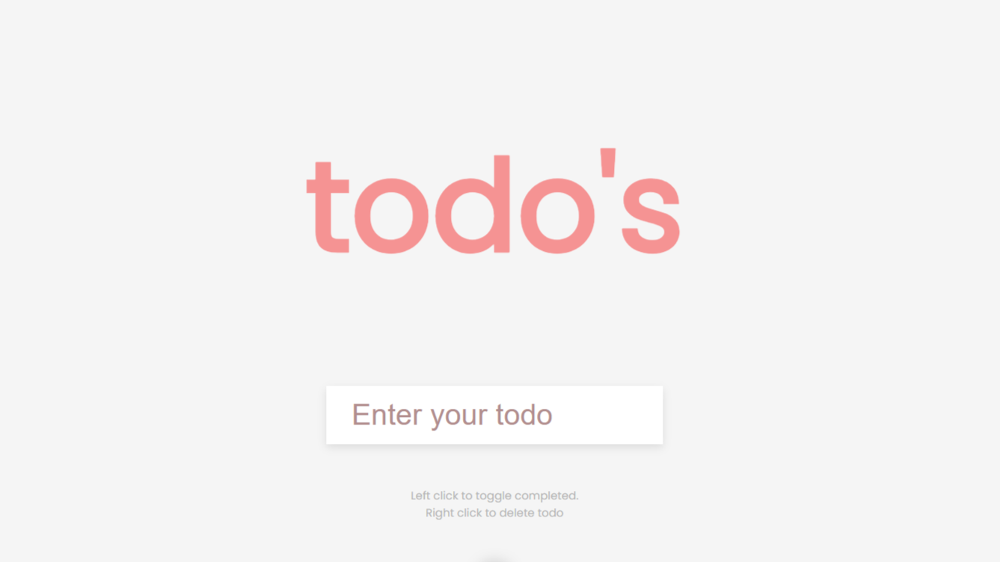

# 📝 Todo List App

A simple and interactive **Todo List** built using **HTML, CSS, and JavaScript**.  
This app allows users to add, complete, and delete tasks, with persistence using **localStorage** so todos remain even after refreshing the page.

---

## 🚀 Features
- ➕ Add new todos  
- ✅ Mark todos as completed (by left click)  
- ❌ Delete todos (by right click)  
- 💾 Saves todos in **localStorage**  
- 🎨 Clean and responsive UI with **Poppins font**

---

## 🛠️ Tech Stack
- **HTML5**  
- **CSS3**  
- **JavaScript**

---

## 📸 Screenshot

## ⚙️ How It Works
* Type your task in the input box and press Enter or submit.
* Left Click a task → Toggle completed ✅
* Right Click a task → Delete it ❌
* Data is stored in localStorage, so tasks remain after page reload.
